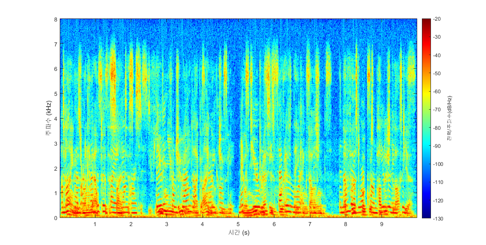
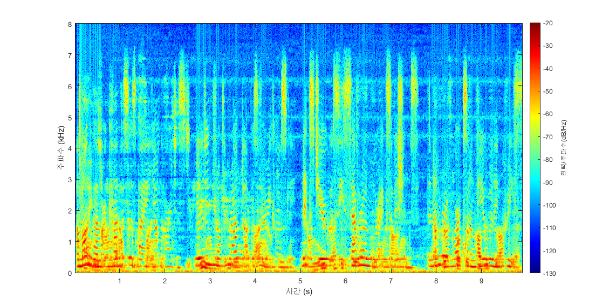
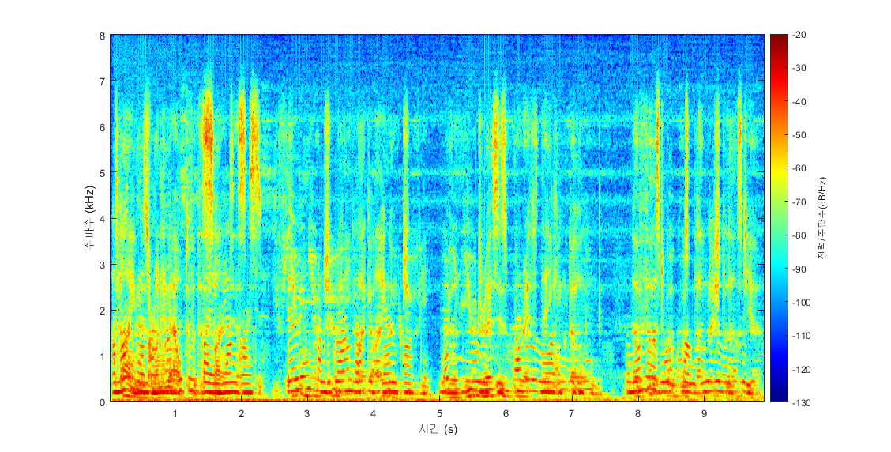

# API_AUXIVA_RLS

---

# **BSS(Blind Source Separation) API란**

서강대 전자공학과 박형민 교수님 연구실에서 제작한 API이며, 여러 화자가 동시에 발화하는 다채널 음원 신호를 입력으로 해당 알고리즘이 예측한 음원 분리 결과를 반환해주는 API입니다.

## **독립성분분석(Independent Vector Analysis, IVA) 알고리즘이란?**

여러 독립적인 신호가 뒤섞인 음원에 대해서 각 출력 채널이 최대한 독립적인 신호로 구성되도록 분리하는 알고리즘입니다.

1. 정상적으로 음원이 분리가 되기 위해서는 입력 마이크 채널의 개수보다 음원의 개수가 더 적어야 합니다.
2. 어떤 음원이 몇 번째 출력 채널로 분리되어 나올지 알 수 없습니다.

## Setting Parameter in AUXIVA_Online.h

```
#define Nch			2
#define nWin		2048
#define BufferSize		512
#define SamplingFreq    16000
```

- `Nch` 은 설정하고자 하는 채널의 개수를 의미하며, 입력 채널의 개수와 동일해야 합니다. 위와 같이 두개의 마이크로 입력된 경우 2로 설정합니다.
- `nWin` 은 short time fourier transform(STFT) 에서 매 프레임 fast fourier transform(FFT)를 진행하기 위한 윈도우 샘플의 개수를 의미합니다. 이는 2의 거듭제곱 수로 설정하며 일반적으로 512~4096내에서 tuning을 진행할 수 있습니다.
- `BufferSize` 는 매 프레임 새로 들어오는 샘플의 개수를 말하며, 매 프레임은 전체 윈도우 샘플의 1/4간격으로 움직이기 때문에 nWin의 1/4값으로 설정 해줍니다.
- `SamplingFreq` 는 입력할 wav 파일의 샘플링 주파수로 설정 해줍니다.

## Build

x64로 빌드를 진행합니다.

## Execution

### **BSS API**

N개의 단일 채널 wav 입력 파일(**각 파일은 단일 채널**)을 입력 인수로 사용합니다. 출력 결과는 output 폴더 내부에 저장됩니다. **output 디렉토리가 없으면 오류가 발생합니다.**

### 실행 예시

빌드된 실행 파일의 이름을 API_BSS라고 가정할 때,

```bash
API_BSS input1.wav input2.wav
```

- **샘플 입력**
샘플 입력은 input디렉토리에 포함되어있습니다.

**input1.wav**

**input2.wav**

**첫번째 채널에 대한 스펙트로그램**



- **샘플 출력**
샘플 출력은 output디렉토리에 포함되어있습니다.

**IVA_ch1.wav**



**IVA_ch2.wav**


